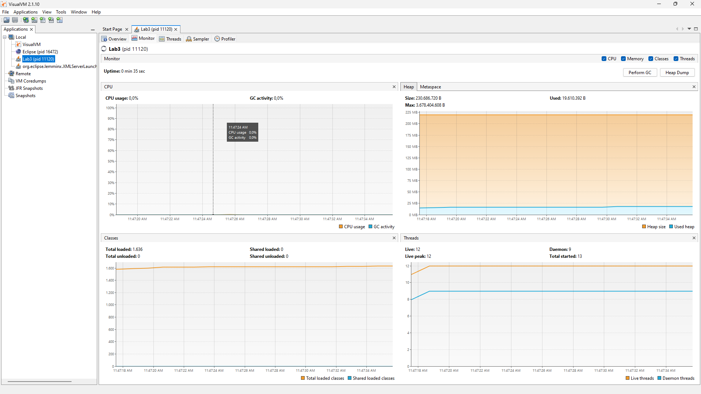

# 🚀 Lab3

## 👥 Integrantes:
---
🎓 Juan Cancelado y 🎓 Diego Chicuazuque

## 🏗️ Productor-Consumidor en Java

Este proyecto implementa el patrón de diseño **Productor-Consumidor** en Java, donde un productor genera datos y los coloca en una cola, mientras que un consumidor retira esos datos y los procesa. 
El programa utiliza hilos para permitir la ejecución concurrente del productor y el consumidor.

---
## 🏛️ Arquitectura

El proyecto está estructurado en varias clases:

- **🛠️ Producer**: Esta clase extiende `Thread` y se encarga de generar números aleatorios y añadirlos a una cola. Utiliza un límite de stock para controlar cuántos elementos puede añadir a la cola.

- **🛠️ Consumer**: Esta clase también extiende `Thread` y se encarga de consumir los números de la cola. Espera hasta que haya elementos disponibles en la cola antes de intentar consumir.

- **🚀 StartProduction**: Esta es la clase principal que inicia la ejecución del programa. Crea una instancia de la cola, inicia el productor y el consumidor, y gestiona el flujo de ejecución.

- **📦 Cola**: Se utiliza `LinkedBlockingQueue` para manejar la cola de elementos, lo que permite una gestión segura de hilos y un límite de capacidad.

---
## 📌 Diagrama de Clases

```plaintext
+-----------------+
|    StartProduction   |
+-----------------+
| - main(String[] args) |
+-----------------+
          |
          |
          v
+-----------------+
|      Producer       |
+-----------------+
| - queue: Queue<Integer> |
| - dataSeed: int       |
| - rand: Random        |
| - stockLimit: int     |
+-----------------+
| + run()              |
+-----------------+
          |
          |
          v
+-----------------+
|      Consumer       |
+-----------------+
| - queue: Queue<Integer> |
+-----------------+
| + run()              |
+-----------------+
```

---
## ⚡ Cómo Ejecutar el Proyecto

1. **📂 Clonar el Repositorio**:
   ```bash
   git clone https://https://github.com/ARSWLABS/Lab3/
   cd LAB3
   ```

2. **🛠️ Compilar el Proyecto**:
   Asegúrate de tener Java instalado en tu máquina. Puedes compilar el proyecto usando el siguiente comando:
   ```bash
   mvn package
   ```

3. **🚀 Ejecutar el Programa**:
   Una vez compilado usamos el IDE de nuestra preferencia para ejecutarlo

---
## 📊 Respondiendo Preguntas

📌 Usando la herramienta **JVisualVM** para ver el consumo actual de recursos al ejecutar el programa:


### ❓ ¿A qué se debe el alto consumo?

🔹 El alto consumo de CPU se debe a que el consumidor está en un bucle infinito que verifica constantemente si hay elementos en la cola. Si la cola está vacía, el consumidor sigue ejecutando el bucle sin hacer nada, lo que consume recursos de CPU innecesariamente.

### 🧐 ¿Cuál es la clase responsable?

📌 La clase responsable de este alto consumo de CPU es la clase **Consumer**, específicamente el método `run()` que contiene el bucle `while (true)`.

### 🔍 Evidencia en JVisualVM con los ajustes pertinentes



---
## ✅ Consideraciones

- **📌 Límite de Stock**: El productor tiene un límite de stock de 5 elementos en la cola. Si la cola está llena, el productor esperará hasta que haya espacio disponible.
- **⚖️ Producción y Consumo**: El productor puede ser configurado para producir rápidamente, mientras que el consumidor puede ser configurado para consumir lentamente, lo que permite observar el comportamiento del sistema bajo diferentes condiciones.

---
## 🤝 Contribuciones

Si deseas contribuir a este proyecto, siéntete libre de abrir un **issue** o enviar un **pull request**. Todas las contribuciones son bienvenidas. 🚀

---
## 📜 Licencia

📌 Este proyecto está bajo la Licencia **MIT**. Consulta el archivo `LICENSE` para más detalles. 📝

