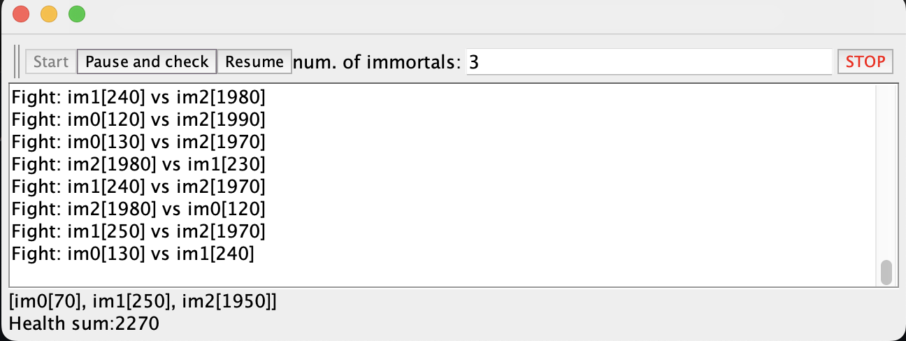

# 🚀 Lab3

## 👥 Integrantes:
---
🎓 Juan Cancelado y 🎓 Diego Chicuazuque

## 🏰 Productor-Consumidor en Java

Este proyecto implementa el patrón de diseño **Productor-Consumidor** en Java, donde un productor genera datos y los coloca en una cola, mientras que un consumidor retira esos datos y los procesa.
El programa utiliza hilos para permitir la ejecución concurrente del productor y el consumidor.

---
## 🏰 Arquitectura

El proyecto está estructurado en varias clases:

- **🛠️ Producer**: Esta clase extiende `Thread` y se encarga de generar números aleatorios y añadirlos a una cola. Utiliza un límite de stock para controlar cuántos elementos puede añadir a la cola.

- **🛠️ Consumer**: Esta clase también extiende `Thread` y se encarga de consumir los números de la cola. Espera hasta que haya elementos disponibles en la cola antes de intentar consumir.

- **🚀 StartProduction**: Esta es la clase principal que inicia la ejecución del programa. Crea una instancia de la cola, inicia el productor y el consumidor, y gestiona el flujo de ejecución.

- **📦 Cola**: Se utiliza `LinkedBlockingQueue` para manejar la cola de elementos, lo que permite una gestión segura de hilos y un límite de capacidad.

---
## 📌 Diagrama de Clases

```plaintext
+-----------------+
| StartProduction |
+-----------------+
| - main(String[] args) |
+-----------------+
          |
          |
          v
+-----------------+
| Producer       |
+-----------------+
| - queue: Queue<Integer> |
| - dataSeed: int       |
| - rand: Random        |
| - stockLimit: int     |
+-----------------+
| + run()              |
+-----------------+
          |
          |
          v
+-----------------+
| Consumer       |
+-----------------+
| - queue: Queue<Integer> |
+-----------------+
| + run()              |
+-----------------+
```

---
## 📌 Explicación de Queue y LinkedBlockingQueue

- **Queue**: `Queue` es una interfaz en Java que define una estructura de datos en la que los elementos se agregan al final y se eliminan desde el principio (FIFO - First In, First Out). No es segura para hilos por sí sola y necesita una implementación sincronizada si se usa en entornos multihilo.

- **LinkedBlockingQueue**: Es una implementación de `BlockingQueue` que está diseñada específicamente para ser segura en entornos multihilo. Utiliza una lista enlazada internamente y permite establecer un tamaño máximo para la cola. Al ser una cola bloqueante, maneja automáticamente la sincronización entre productores y consumidores, evitando problemas de concurrencia como el sondeo activo y la sobrecarga del CPU.

---
## ⚡ Cómo Ejecutar el Proyecto

1. **💂🏼 Clonar el Repositorio**:
   ```bash
   git clone https://github.com/ARSWLABS/Lab3
   cd LAB3
   ```

2. **🛠️ Compilar el Proyecto**:
   Asegúrate de tener Java instalado en tu máquina. Puedes compilar el proyecto usando el siguiente comando:
   ```bash
   mvn package
   ```

3. **🚀 Ejecutar el Programa**:
   Una vez compilado, puedes ejecutarlo desde tu IDE de conveniencia

---
## 💊 Revisión del Código y Análisis del Invariante (Highlander-Simulator)

El juego **Highlander-Simulator** implementa la mecánica de lucha entre inmortales de la siguiente manera:

### 🌟 Creación de Inmortales

- Se crean **N** jugadores (`Immortal`), cada uno con una vida inicial de 100 puntos (`DEFAULT_IMMORTAL_HEALTH`).
- Todos los inmortales comparten una lista `immortalsPopulation`, que les permite acceder a sus oponentes.

### ⚔️ Ataques entre Inmortales

- Cada inmortal corre en un **hilo independiente** (`Thread`).
- En el método `run()`, cada inmortal selecciona aleatoriamente a otro inmortal y lo ataca (`fight(Immortal i2)`).
- Si el oponente (`i2`) tiene más de 0 puntos de vida:
  - Se le resta **10** puntos de vida (`DEFAULT_DAMAGE_VALUE`).
  - El atacante suma **10** puntos de vida.
  - Este ciclo se repite indefinidamente.

### 📝 Invariante: Conservación de la Suma Total de Vida

- Antes de que comiencen las peleas, la **suma de vida total** es:
  - `Suma_inicial = N x 100`.
- Durante la ejecución del juego, aunque los valores individuales cambian, el **total de puntos de vida** debería permanecer constante siempre que no haya interferencias en las operaciones de actualización.
- Sin embargo, debido a la naturaleza concurrente del código, pueden existir **condiciones de carrera** que alteren esta propiedad.

### 🎯 Cálculo del Valor Invariante

Para **N** inmortales, cada uno comenzando con **100** puntos de vida, la sumatoria inicial debe ser:
  - `Suma_total = N x 100`

Este valor **debería mantenerse constante** en un instante donde no haya operaciones concurrentes en progreso.

### 🔍 El Invariante se Cumple?
Si el invariante se cumple, entonces la suma total de los puntos de vida deberian ser siempre N x 100.


como podemos observar en esta imagen no se esta cumpliendo dicho invariante, ya que tenemos 3 jugadores inmortales y la suma nos esta dando 2270.


  **🔎 Posibles causas:**
  - **Condiciones de carrera**: Si varios hilos acceden a la vida de un inmortal sin **sincronización adecuada**, pueden ocurrir inconsistencias.

---
## 🤝 Contribuciones

Si deseas contribuir a este proyecto, siéntete libre de abrir un **issue** o enviar un **pull request**. Todas las contribuciones son bienvenidas. 🚀

---
## 🐝 Licencia

📌 Este proyecto está bajo la Licencia **MIT**. Consulta el archivo `LICENSE` para más detalles. 📝


